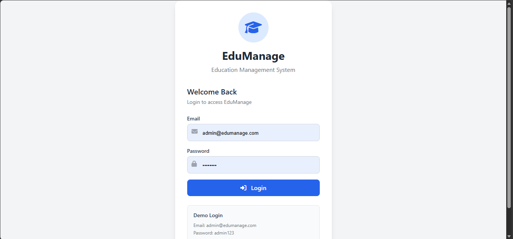
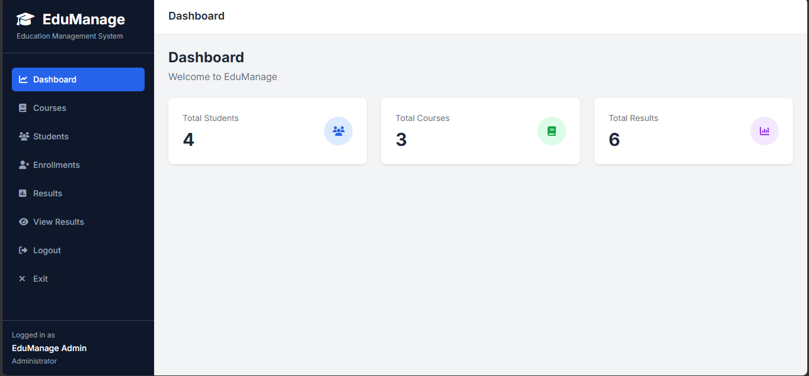
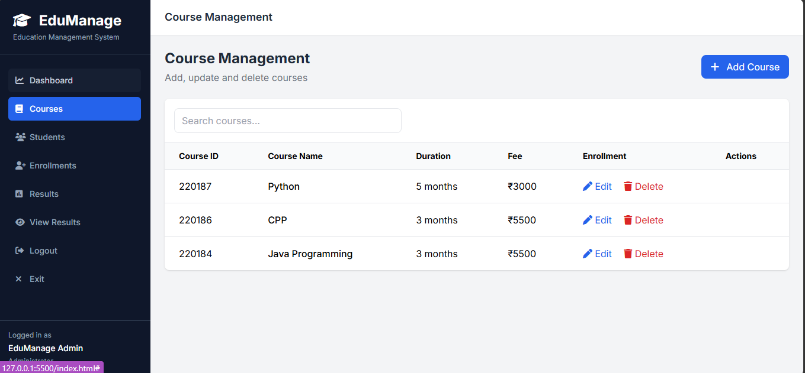
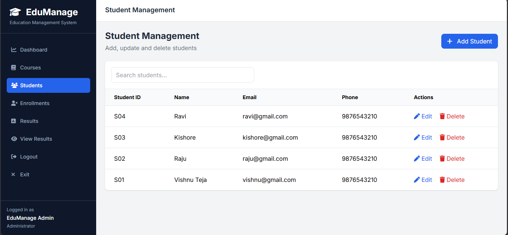
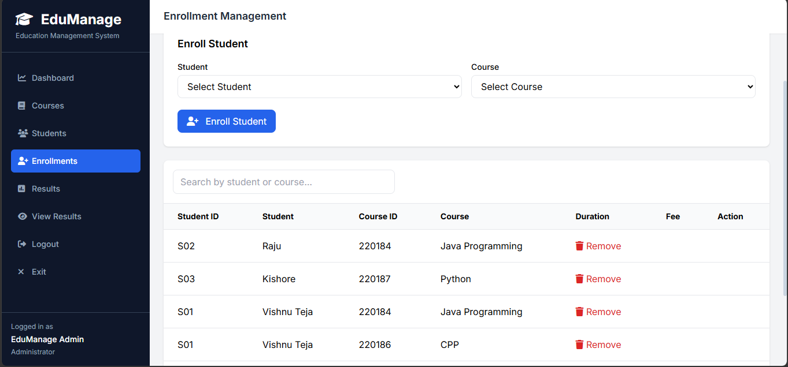
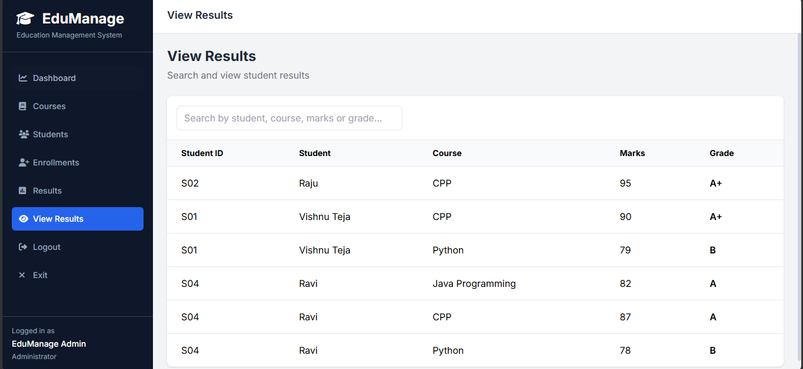

# 🎓 EduManage - Education Management System

EduManage is a full-stack Education Management System for managing students, courses, enrollments, and academic results through a centralized web application.

The system provides separate access for **Administrators** and **Students** using JWT-based authentication and role-based authorization.

## 🌐 Live Application

[Open EduManage](https://edumanage-9j8y.onrender.com/login.html)

---

## 🚀 Features

### 👨‍💼 Admin Features

- Secure admin login
- Dashboard with statistics
- Add, view, update, and delete students
- Add, view, update, and delete courses
- Enroll students into courses
- Add, update, and delete student results
- Search and filter students and courses
- Manage student accounts
- Role-based access control
- Password hashing using `bcryptjs`

### 👨‍🎓 Student Features

- Secure student login
- Student dashboard
- View enrolled courses
- View personal academic results
- View student-specific information
- Administrative operations restricted to administrators
- Logout functionality

---

## 🛠️ Tech Stack

### Frontend

- HTML5
- CSS3
- Vanilla JavaScript

### Backend

- Node.js
- Express.js
- REST APIs

### Database

- MongoDB Atlas
- MongoDB access through `mongoose`

### Authentication and Security

- JSON Web Tokens (JWT)
- `bcryptjs`
- Role-Based Access Control (RBAC)

### Development Tools

- Git and GitHub
- VS Code
- npm

---

# 📸 Screenshots

The screenshots below show the main EduManage user flow. Additional screens can be added to the `screenshots/` folder using the same numbered naming convention.

### 1. Login



### 2. Dashboard



### 3. Course Management



### 4. Student Management



### 5. Enrollment Management



### 6. View Results



---

# 🏗️ System Architecture

```text
                         ┌───────────────────────┐
                         │       User            │
                         │  Admin / Student      │
                         └───────────┬───────────┘
                                     │
                                     ▼
                         ┌───────────────────────┐
                         │      Frontend         │
                         │ HTML + CSS + JavaScript│
                         └───────────┬───────────┘
                                     │
                              HTTP / REST API
                                     │
                                     ▼
                         ┌───────────────────────┐
                         │       Backend         │
                         │  Node.js + Express.js │
                         └───────────┬───────────┘
                                     │
                    ┌────────────────┴────────────────┐
                    │                                 │
                    ▼                                 ▼
          ┌───────────────────┐             ┌───────────────────┐
          │ Authentication    │             │ Authorization     │
          │ JWT + bcryptjs    │             │ Admin / Student   │
          └───────────────────┘             └───────────────────┘
                    │                                 │
                    └────────────────┬────────────────┘
                                     │
                                     ▼
                         ┌───────────────────────┐
                         │     MongoDB Atlas     │
                         │       Database        │
                         └───────────┬───────────┘
                                     │
             ┌───────────────────────┼────────────────────────┐
             │                       │                        │
             ▼                       ▼                        ▼
       ┌───────────┐           ┌───────────┐            ┌───────────┐
       │ Students  │           │  Courses  │            │ Results   │
       └───────────┘           └───────────┘            └───────────┘
                                     │
                                     ▼
                              ┌─────────────┐
                              │ Enrollments │
                              └─────────────┘
```

---

# 🔐 Authentication Flow

```text
User
  │
  ▼
Login Page
  │
  │ Email + Password
  ▼
POST /api/auth/login
  │
  ▼
Backend
  ├── Find user
  ├── Compare password using bcryptjs
  └── Generate JWT
          │
          ▼
       Frontend
          │
          └── Store JWT
                  │
                  ▼
          Protected API Requests
                  │
                  ▼
             JWT Validation
                  │
                  ▼
           Role Verification
             /           \
            /             \
        Admin           Student
          │                 │
          ▼                 ▼
    Full Access        View-Only Access
```

---

# 🗄️ MongoDB Database Architecture

EduManage uses MongoDB Atlas with five collections: `users`, `students`, `courses`, `enrollments`, and `results`. The application uses numeric `id` values for its public relationships and hides MongoDB's internal `_id` from API responses. Relationships and validation are enforced by the Node.js database adapter, while MongoDB unique indexes protect email, student ID, course ID, and duplicate enrollment/result combinations.

```text
┌─────────────────────┐
│      students       │
├─────────────────────┤
│ id (identifier)     │
│ student_id (unique) │
│ name                │
│ email (unique)      │
│ phone               │
└──────────┬──────────┘
           │
           ├──────────────────────┐
           │                      │
           ▼                      ▼
┌─────────────────────┐    ┌─────────────────────┐
│    enrollments      │    │       results       │
├─────────────────────┤    ├─────────────────────┤
│ id (identifier)     │    │ id (identifier)     │
│ student_id (ref)    │    │ student_id (ref)    │
│ course_id (ref)     │    │ course_id (ref)     │
└──────────┬──────────┘    │ marks               │
           │               │ grade               │
           ▼               └──────────┬──────────┘
┌─────────────────────┐              │
│       courses       │◄─────────────┘
├─────────────────────┤
│ id (identifier)     │
│ course_id (unique)  │
│ name                │
│ duration            │
│ fee                 │
└─────────────────────┘

┌─────────────────────┐
│        users        │
├─────────────────────┤
│ id (identifier)     │
│ name                │
│ email (unique)      │
│ password            │
│ role                │
│ student_id (ref)    │
└─────────────────────┘
```

### Relationships

- One student can enroll in multiple courses.
- One course can have multiple students.
- A student can have results for multiple courses.
- A student account is linked to a student record.
- Admin accounts are not linked to a student record.
- Results can be added only for a student-course pair that already exists in `enrollments`.
- Related records are removed by application logic when a student or course is deleted.

---

# 📂 Project Structure

```text
EduManage/
│
├── css/
│   └── style.css
│
├── js/
│   ├── script.js
│   └── login.js
│
├── server/
│   ├── database.js
│   ├── server.js
│   ├── createadmin.js
│   └── createstudent.js
│
├── database/
│   └── MongoDB data is hosted in MongoDB Atlas
│
├── index.html
├── login.html
├── test-api.html
├── package.json
├── render.yaml
├── .env.example
├── .gitignore
└── README.md
```

---

# 🔄 Application Workflow

## Admin Workflow

```text
Admin Login
     │
     ▼
Admin Dashboard
     │
     ├── Student Management
     │      ├── Add Student
     │      ├── Edit Student
     │      └── Delete Student
     │
     ├── Course Management
     │      ├── Add Course
     │      ├── Edit Course
     │      └── Delete Course
     │
     ├── Enrollment
     │      └── Enroll Student
     │
     └── Result Management
            ├── Add Result
            ├── Edit Result
            └── Delete Result
```

## Student Workflow

```text
Student Login
      │
      ▼
Student Dashboard
      │
      ├── My Courses
      ├── My Results
      └── Profile / Information
```

---

# 🔌 REST API

## Authentication

```text
POST /api/auth/login
```

## Students

```text
GET    /api/students
POST   /api/students
GET    /api/students/:id
PUT    /api/students/:id
DELETE /api/students/:id
```

## Courses

```text
GET    /api/courses
POST   /api/courses
GET    /api/courses/:id
PUT    /api/courses/:id
DELETE /api/courses/:id
```

## Enrollments

```text
GET  /api/enrollments
POST /api/enrollments
```

## Results

```text
GET    /api/results
POST   /api/results
PUT    /api/results/:id
DELETE /api/results/:id
```

## Student-Specific APIs

```text
GET /api/my-courses
GET /api/my-results
```

These endpoints return only the authenticated student's own academic information.

---

# 🔒 Security

### Password Hashing

Passwords are hashed using `bcryptjs` before being stored in the database. Passwords should never be stored as plain text.

### JWT Authentication

Protected API requests require:

```text
Authorization: Bearer <JWT_TOKEN>
```

### Role-Based Authorization

The application supports two roles:

```text
admin
student
```

Administrative operations are protected at the backend level rather than relying only on hidden frontend buttons.

> Before production deployment, move the JWT secret from `server/server.js` into a secure environment variable. Never commit real credentials or database files.

---

# ⚙️ Installation and Setup

## 1. Clone the repository

```bash
git clone https://github.com/Vishnuteja16/EduManage.git
```

## 2. Navigate to the project

```bash
cd EduManage
```

## 3. Install dependencies

```bash
npm install
```

## 4. Configure environment variables

Create a root `.env` file for local development, or add these variables in your hosting provider:

```text
DATABASE_URL=<MongoDB connection string>
MONGODB_DATABASE=edumanage
JWT_SECRET=<long random secret>
ADMIN_EMAIL=admin@edumanage.com
ADMIN_PASSWORD=<strong admin password>
```

Do not commit these values to GitHub.

For MongoDB Atlas, create a database user under **Database Access**, allow the deployment IP under **Network Access**, and copy the connection string from **Connect → Drivers**. URL-encode special characters in the database password, such as `@` (`%40`) and `#` (`%23`).

## 5. Start the backend

```bash
npm start
```

The server runs at:

```text
http://localhost:5000
```

## 6. Open the application

Open `login.html` in a browser after starting the backend.

The server connects to MongoDB and creates the required unique indexes automatically on startup.

Configure `DATABASE_URL`, `MONGODB_DATABASE`, `JWT_SECRET`, `ADMIN_EMAIL`, and `ADMIN_PASSWORD` environment variables in the hosting provider. Do not commit the MongoDB connection string or its password.

---

# 🧪 Testing

Use `test-api.html` to manually check API behavior while the server is running.

The project currently does not include an automated test suite.

---

# 🌐 Deployment

The recommended deployment is a single Render web service connected to MongoDB Atlas. The Express server serves both the static frontend and the `/api` routes, so no separate frontend host is required.

```text
Frontend and API → Render web service
Database          → MongoDB Atlas
```

## Deploy with Render

1. Push the repository to GitHub. Keep `.env` out of the repository.
2. In Render, select **New → Web Service** and connect the GitHub repository.
3. Use these service settings:

```text
Runtime: Node
Build command: npm install
Start command: npm start
Health check path: /
```

4. Add these environment variables in Render:

```text
DATABASE_URL=<MongoDB Atlas connection string>
MONGODB_DATABASE=edumanage
JWT_SECRET=<long random secret>
ADMIN_EMAIL=<admin email>
ADMIN_PASSWORD=<strong admin password>
```

5. Deploy the service and open the live application at [https://edumanage-9j8y.onrender.com/login.html](https://edumanage-9j8y.onrender.com/login.html).

The repository includes `render.yaml` with the build command, start command, health check, and required environment variable definitions. `DATABASE_URL`, `ADMIN_EMAIL`, and `ADMIN_PASSWORD` must still be supplied in Render because they are marked as secret values.

If the frontend is hosted separately on Vercel or another static host, update `API_URL` in `js/script.js` to point to the deployed backend URL, for example `https://your-backend.onrender.com/api`, and configure CORS for that origin.

Production architecture:

```text
                User
                  │
                  ▼
             Static Host
              Frontend
                  │
                  │ HTTPS / REST API
                  ▼
              Node Host
          Node + Express API
                  │
                  ▼
        Persistent Database Storage
```

> Keep the MongoDB connection string and application secrets in the hosting provider's environment settings, never in the repository.

---

# 🎯 Future Improvements

- MongoDB indexes and backups
- Password change functionality
- Email notifications
- Attendance management
- Fee and payment management
- Admin and student profile editing
- Advanced analytics and pagination
- Automated tests
- Docker support
- Environment-based configuration

---

# 💡 Learning Outcomes

This project demonstrates:

- Frontend development with HTML, CSS, and JavaScript
- REST API development with Node.js and Express.js
- CRUD operations
- MongoDB collection design and application-level relationships
- JWT authentication and password hashing
- Role-Based Access Control
- API integration and database relationships
- Git and GitHub workflow
- Full-stack application architecture

---

# 👨‍💻 Author

**Yanamala Sai Vishnu Teja**

B.Tech - Computer Science and Engineering
Mohan Babu University

---

## ⭐ Project Highlights

```text
Frontend
   ↓
REST API
   ↓
Authentication
   ↓
Authorization
   ↓
Business Logic
   ↓
MongoDB Atlas Collections
```

EduManage demonstrates a practical education management platform with secure authentication, role-based access, and database-driven CRUD operations.

---

## 📜 License

This project is licensed under the MIT License. See [LICENSE](LICENSE) for details.